# **Broken-Web-Application** 
 
Spring Web-Application that contains six different flaws -from the [OWASP 2013 Top 10 List](https://www.owasp.org/index.php/Top_10_2013-Top_10)- and their fixes.

# Index

- [Index](#index)
- [An Overview of The Web Application](#an-overview-of-the-web-application)
- [Prerequisites](#prerequisites)
- [Setup](#setup)
- [Vulnerabilities](#vulnerabilities)
  - [A3-Cross-Site Scripting (XSS)](#a3-cross-site-scripting-xss)
    - [Required steps to reproduce the vulnerability](#required-steps-to-reproduce-the-vulnerability)
	- [Identifying the vulnerability using OWASP Zed Attack Proxy (ZAP)](#identifying-the-vulnerability-using-owasp-zed-attack-proxy-zap)
	- [Where the vulnerability came from](#where-the-vulnerability-came-from)
	- [How to fix it](#how-to-fix-it)
  - [A10-Unvalidated Redirects and Forwards](#a10-unvalidated-redirects-and-forwards)
    - [Required steps to reproduce the vulnerability](#required-steps-to-reproduce-the-vulnerability-1)
	- [Where the vulnerability came from](#where-the-vulnerability-came-from-1)
	- [How to fix it](#how-to-fix-it-1)
  - [A8-Cross-Site Request Forgery (CSRF)](#a8-cross-site-request-forgery-csrf)
    - [Required steps to reproduce the vulnerability](#required-steps-to-reproduce-the-vulnerability-2)
	- [Where the vulnerability came from](#where-the-vulnerability-came-from-2)
	- [How to fix it](#how-to-fix-it-2)
  - [A7-Missing Function Level Access Control](#a7-missing-function-level-access-control)
    - [Required steps to reproduce the vulnerability](#required-steps-to-reproduce-the-vulnerability-3)
	- [Identifying the vulnerability using OWASP Zed Attack Proxy (ZAP)](#identifying-the-vulnerability-using-owasp-zed-attack-proxy-zap-1)
	- [Identifying the vulnerability using DIRB](#identifying-the-vulnerability-using-dirb)
	- [Where the vulnerability came from](#where-the-vulnerability-came-from-3)
	- [How to fix it](#how-to-fix-it-3)
  - [A1-Injection](#a1-injection)
    - [Required steps to reproduce the vulnerability](#required-steps-to-reproduce-the-vulnerability-4)
	- [Identifying the vulnerability using OWASP Zed Attack Proxy (ZAP)](#identifying-the-vulnerability-using-owasp-zed-attack-proxy-zap-2)
	- [Where the vulnerability came from](#where-the-vulnerability-came-from-4)
	- [How to fix it](#how-to-fix-it-4)
  - [A6-Sensitive Data Exposure](#a6-sensitive-data-exposure)
    - [Required steps to reproduce the vulnerability](#required-steps-to-reproduce-the-vulnerability-5)
	- [Identifying the vulnerability using Fiddler](#identifying-the-vulnerability-using-fiddler)
	- [Identifying the vulnerability using Wireshark](#identifying-the-vulnerability-using-wireshark)
	- [Identifying the vulnerability using Ettercap](#identifying-the-vulnerability-using-ettercap)
	- [Where the vulnerability came from](#where-the-vulnerability-came-from-5)
	- [How to fix it](#how-to-fix-it-5)


# An Overview of The Web Application

For the sake of simplicity, I stayed away from complex architecture and vague syntax. Simply the web application has two main pages.. that is _/sixWordStories_ and _/quotes_. The former just contains short stories of 6 words only, and the latter contains some quotes.. Both has the ability to add new entries.

# Prerequisites

- JDK 1.8
- Maven
- OWASP Zed Attack Proxy (i.e. ZAP) [optional]
- Wireshark [optional]
- Fiddler [optional]
- Ettercap [optional]
- Netbeans (or another suitable IDE) if you are not comfortable with using the command line.

# Setup

1. _Clone_ the repository or _download the zip file_ of the repository and _import_ the project to your _IDE_.
2. Build the Project using _Maven_, then Run it.

# **Vulnerabilities**:
## **A3-Cross-Site Scripting (XSS)**

> XSS flaws occur whenever an application takes untrusted data and sends it to a web browser without proper validation or escaping. XSS allows attackers to execute scripts in the victim’s browser which can hijack user sessions, deface web sites, or redirect the user to malicious sites.

### _Required steps to reproduce the vulnerability:_ 

1. Navigate to Six-Word Sories page (e.g. http://localhost:8080/sixWordStories). And if you prompted for credentials type "user" as the username & "password" as the password.
2. Insert any text in the input field next to "Title:" (e.g. xss).
3. In the input field next to "Story:", write:

  ```javascript
  	</noscript><br><code onmouseover=a=eval;b=alert;a(b(/XSS/.source));>MOVE MOUSE OVER THIS AREA</code>
  ```
 and click on "Add".  
4. You can see that new Story has been added and if you hover your mouse on it you got a Popup message-box that says "XSS".

#### Identifying the vulnerability using _OWASP Zed Attack Proxy (ZAP):_

1. Open the OWASP Zed Attack Proxy (ZAP), on the `quick start` tab type "http://localhost:8080" (or http://[HostIp]:[Port] for example "http://192.168.1.3:8080") inside the `URL to attack` & click on `Attack`. You will notice that all requests refused by the server because you have to login first. So we will _fuzz_ the username & password.

2. Click on `New Fuzzer` and choose `http://localhost:8080`, then choose `POST:login(password,submit,username)` and click `select`. Then highlight the value of the username parameter and add a file that contains most common usernames as a payload (e.g. [top-usernames-shortlist.txt](https://github.com/danielmiessler/SecLists/blob/master/Usernames/top-usernames-shortlist.txt)). Do the same for the value of the password parameter but this time with a file contains the most common passwords (e.g. [probable-v2-top207.txt](https://github.com/danielmiessler/SecLists/blob/master/Passwords/probable-v2-top207.txt)). Finally click on `Start Fuzzer`.
  
  
  
3. After the fuzzing is completed, we need to search for something odd in the results. We notice that the size of the *response header* is the same for all requests except for two requests: the first request contains(user, password) as a payload, and the second contains(admin, test) as a payload. those are the right credentials we need.

  
  
4. Create new context to add the credentials: click on `sites` then right click on `http://localhost:8080` > `Include in Context` > `New Context`.

  
  
5. Choose `Authentication` and select `Form-based Authentication` from the drop-down list. Click on `Select` and choose `Sites` then `http://localhost:8080` then `POST:login(password,submit,username)` then click on `Select`. `http://localhost:8080/login` will appear as the Login Form Target URL. Then choose `username` as the username parameter & `password` as the password parameter. Finally set the *logged out indicators* to tell ZAP how to identify whether an authentication succeeded or not.. to do that in our case set `login` as the regex pattern identified in logged out response messages.  
(Explanation: the string "Location: http://[HostIp]:[Port]/**login**" appears at the response header if we're not already authenticated. the **location** response-header field is used to redirect us to a location other than the Requested URL).  

  

6. Choose `Users`, then click on `Add`, give an arbitrary name for `User Name` such as "Normal User", and type "user" as the `Username` & "password" as the `Password`, then click `OK`.

  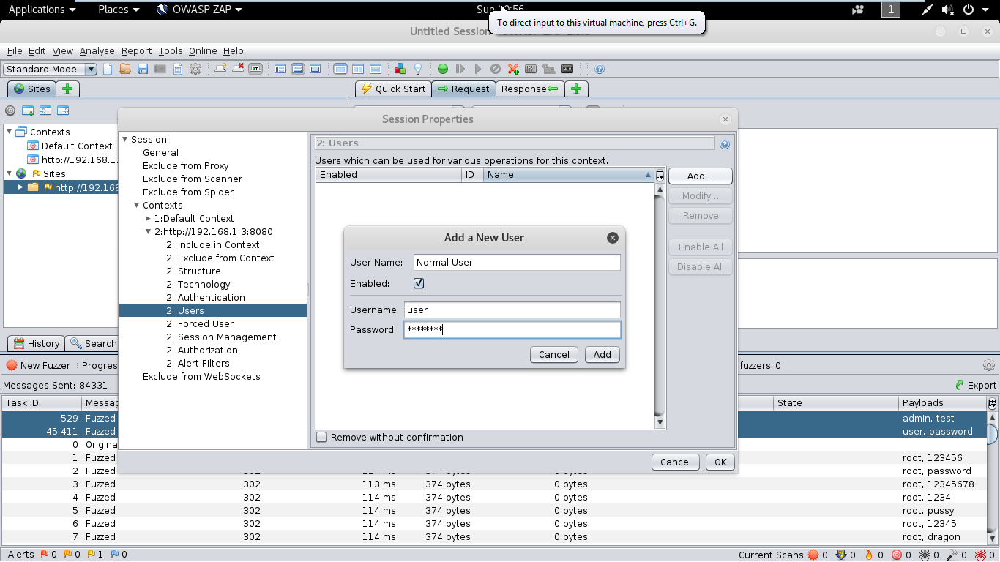
  
7. Choose `Spider` and click on `New Scan` and choose `http://localhost:8080` as starting point, choose both the Context & the user you just created then click on `Start Scan`.
  
  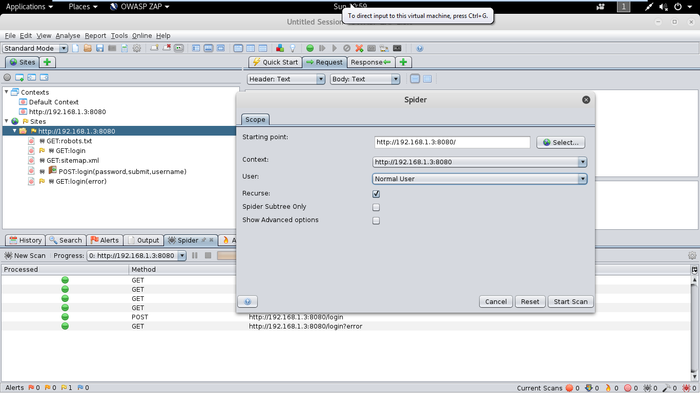
  
8. You will notice that -unlike the first time which returned a login error page for every request- the ZAP shows many pages. Now the `Spider` can create a map of the application with all the points of access to the application (no not really! check the _Missing Function Level Access Control_ vulnerability section).

  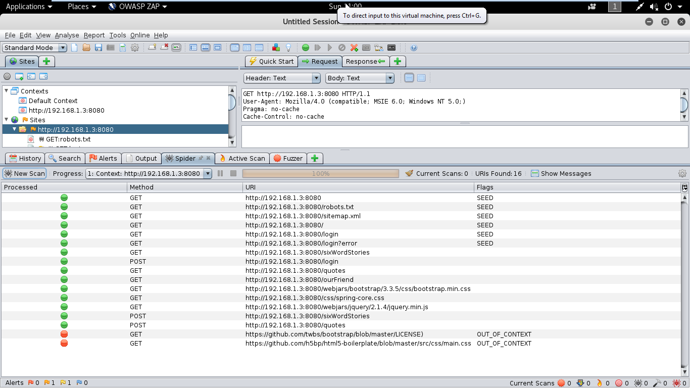
  
9. Now click on `New Fuzzer` and choose `http://localhost:8080`, then choose `POST:sixWordStories(content,title)` and click `select`. Then highlight the value of the content parameter and add a `file fuzzer` (XSS that contains [XSS101]) as a payload.  

  
  
  Click on `Message Processors` tab, click on `Add` and select `User Message Processor` as the type, `http://localhost:8080` as the context and `Normal User` as the user.  

  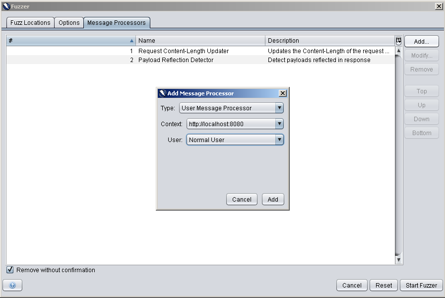

  Finally click on `Start Fuzzer`.  

10. After completion of the fuzzing process, navigate to `http://localhost:8080/sixWordStories` and you will notice pop-up messages and other things that indicates XSS vulnerability.

  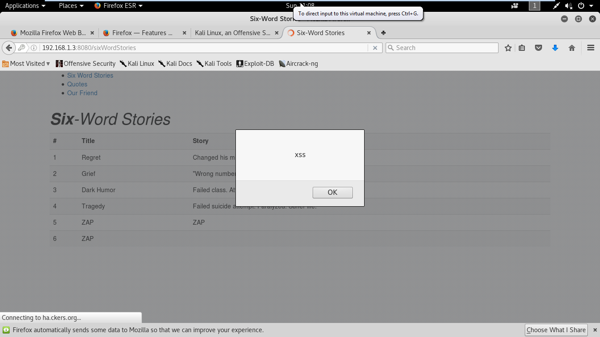
  

### _Where the vulnerability came from:_

First of all, We use "Thymeleaf" as our template engine. So in "sixWordStories.html", there is unescaped element in the template:

  ```html
      <td th:utext="${post.content}"></td>
  ```
  
here the "th:utext" (for "unescaped text") caused the XSS vulnerability, because it tells the "Thymeleaf" not to escape the text which may contain malicious javascript code.

### _How to fix it:_

Simply you can use `th:text` instead of `th:utext`. `th:text` is the default behaviour of "Thymeleaf" which makes sure that text should be escaped.

## **A10-Unvalidated Redirects and Forwards**

  > Web applications frequently redirect and forward users to other pages and websites, and use untrusted data to determine the destination pages. Without proper validation, attackers can redirect victims to phishing or malware sites, or use forwards to access unauthorized pages.

### _Required steps to reproduce the vulnerability:_

1. Navigate to either Six-Word Sories page (i.e. http://localhost:8080/sixWordStories) or Quotes page (i.e. http://localhost:8080/quotes). And if you prompted for credentials type "user" as the username & "password" as the password.

2. At the top of the page, click on "Our Friend" link. It will open a new tab on your browser and display a page that tells you "If this vulnerability worked, your previous page is now redirected to www.hackerrank.com".

3. Check your previous page now to make sure that the redirection happened.

### _Where the vulnerability came from:_

In "header.html" template, the "Our Friend" link is constructed using this piece of code:

  ```html
      <li><a th:href="@{/ourFriend}" target="_blank">Our Friend</a></li>
  ```

Notice `target="_blank"` which opens the linked document (i.e. /ourFriend) in a new window or tab.
The Problem is that the destination page (i.e.. /ourFriend) has the ability to control the location of this page by modifying `window.opener.location`. It may leads to phishing attacks. 

In our site we refer to /ourFriend page as friend web page that is trusted by us. but what if this page has been hacked recently and someone insert a malicious code in it, for example:

  ```javascript
    <script>
      if (window.opener != null) {
          window.opener.location.replace('https://www.hackerrank.com');
      }
    </script>
  ```

In this example the destination page attempts to modify the location of this page using 

  ```javascript
      window.opener.location.replace('https://www.hackerrank.com');`
  ```

### _How to fix it:_

One of the solutions for this problem is to add an attribute `rel="noreferrer noopenner"` to the hyperlink element. In our example we need to modify it to be like this:

  ```html
      <li><a th:href="@{/ourFriend}" target="_blank" rel="noreferrer noopenner">Our Friend</a></li>
  ```

## **A8-Cross-Site Request Forgery (CSRF)**

  > A CSRF attack forces a logged-on victim’s browser to send a forged HTTP request, including the victim’s session cookie and any other automatically included authentication information, to a vulnerable web application. This allows the attacker to force the victim’s browser to generate requests the vulnerable application thinks are legitimate requests from the victim.

### _Required steps to reproduce the vulnerability:_

1. Navigate to "Quotes" page (i.e. http://localhost:8080/quotes). And if you prompted for credentials type "user" as the username & "password" as the password.
2. In the Project folder (i.e. ../broken-web-application) there is a template called "csrf.html", open it on your browser (right click on "csrf.html" and choose "Open").  
[IMPORTANT: open the "csrf.html" with the same browser you have logged in with]  
3. The page contains a text "Want to win a lot of money with just ONE click!" and a button "Win Money!".. who doesn't want to win money! click on it.
4. Navigate to "Quotes" page (i.e. http://localhost:8080/quotes), you will find that there is a new quote added with ID #99 and	Quote "Inappropriate text contains Profanity". So simply the csrf.html manipulated you by inserting a quote against your will.

### _Where the vulnerability came from:_

The malicious page (i.e. csrf.html) has a hidden form inside of it that will be submitted if you hit the "Win Money!" button. Take a look at the code:

```html
<form id="command" action="http://localhost:8080/quotes" method="post">

    <input type="hidden" name="id" value="99">

    <input type="hidden" name="content" value="Inappropriate text contains Profanity">

    <input value="Win Money!" type="submit">

</form>
```

Because you are currently authenticated by a cookie saved in your browser, the malicious page may send an HTTP request on your behalf to the site -which trusts you- and thereby causes an unwanted action Without your intention. Here the side effects may be posting text contains profanity which leads to ban you from the site. 

It is also worth to mention that the malicious page could be implemented to be more tricky that you doesn't need to click on anything and the request will be sent as soon as you just open (i.e. load) the page.. here is an example:

```html
<!DOCTYPE html>
<html>

  <head>
    <title>Win Money!</title>
  </head>

  <body onload="document.csrfForm.submit()">
    <p>wasted!</p>

    <form action="http://localhost:8080/quotes" method="POST" target="hiddenFrame" name="csrfForm">
      <input type="hidden" name="id" value="97"/>
      <input type="hidden" name="content" value="Another Inappropriate text that contains Profanity"/>
    </form>

    <iframe name="hiddenFrame" style="display: none;"></iframe>
  </body>
  
</html>
```
### _How to fix it:_

The problem with this vulnerability is that there is no difference between the HTTP request sent by the malicious page and the one that sent by you. So we need to add something to the HTTP request can't be supplied by the malicious site. So in order to complete the request the sender needs to provide the cookie and a token. Every time a request is sent, the server must compare the expected value of the Token with Token itself and if there is no match, the request will not be completed.

So how we prevent CSRF in Spring?.. First we need to include the security dependencies in _pom.xml_: 

```xml
  <dependency>
    <groupId>org.springframework.security</groupId>
    <artifactId>spring-security-web</artifactId>
  </dependency>
  <dependency>
    <groupId>org.springframework.security</groupId>
    <artifactId>spring-security-config</artifactId>
  </dependency>
```

and Second we annotate our application with _@EnableWebSecurity_ annotation like that:

```java
  @EnableWebSecurity
  @SpringBootApplication
  public class BrokenWebApplication {
    public static void main(String[] args) {
      SpringApplication.run(BrokenWebApplication.class, args);
    }
  }
```

or if we already made a custom security configuration we can just annotate our custom security configuration class without annotation the application class like that:

```java
  @EnableWebSecurity
  public class SecurityConfig extends WebSecurityConfigurerAdapter {
    // Your Custom Security Configuration
  }
```

So by including these dependencies, Spring by default prevent CSRF by adding a CSRF Token. So if you tried again to exploit this vulnurability it would fail and will got something like: 
`Invalid CSRF Token 'null' was found on the request parameter '_csrf' or header 'X-CSRF-TOKEN'.`

Notice that if the application contains the security dependencies & the `@EnableWebSecurity` annotation and still has CSRF vulnerability, so probably your custom security configuration conatins this piece of code `http.csrf().disable()` which disable CSRF protection. So to activate the CSRF protection again you shoud delete this piece of code to return the default Spring security configuration.  

## **A7-Missing Function Level Access Control**

> Most web applications verify function level access rights before making that functionality visible in the UI. However, applications need to perform the same access control checks on the server when each function is accessed. If requests are not verified, attackers will be able to forge requests in order to access functionality without proper authorization.

### _Required steps to reproduce the vulnerability:_

_Inception:_ Even if the UI(i.e. User Interface) doesn't show navigation to the unauthorized "admin" page, the attacker can simply force the browser to target the "admin" page URL.
In our case, if the attacker knows the URL of the "admin" page, he can just type http://localhost:8080/admin in the address bar of the browser and he is successfully navigated to the unauthorized page. The "admin" page allows whoever can access it to delete any story or quote.

1. Navigate to (http://localhost:8080/). And if you prompted for credentials type "user" as the username & "password" as the password.

2. In in the address bar of your browser , force it to navigate to the admin page (i.e. http://localhost:8080/admin).

3. Although you are logged in as a normal user, the "admin panel" page is shown and you can now delete any story or quote like if you are the administrator.

#### Identifying the vulnerability using _OWASP Zed Attack Proxy (ZAP):_

(Notice that you can identify this vulnerability with _OWASP DirBuster_ as well).

1. Complete the steps from 1 to 7 in [Identifying the XSS vulnerability using OWASP ZAP](#identifying-the-vulnerability-using-owasp-zed-attack-proxy-zap) section -if you didn't do it already-.

2. Choose "Forced Browse":

  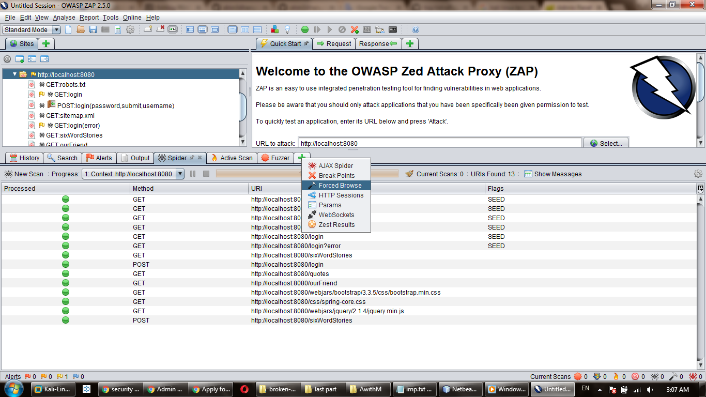
  
3. Choose `localhost:8080` as the site and `directory-list-1.0.txt` as the list and start the forced browse..

4. After a while -not too long-, one page will appears which didn't appear before in any spider crawling scan.. that is the admin page (http://localhost:8080/admin).

  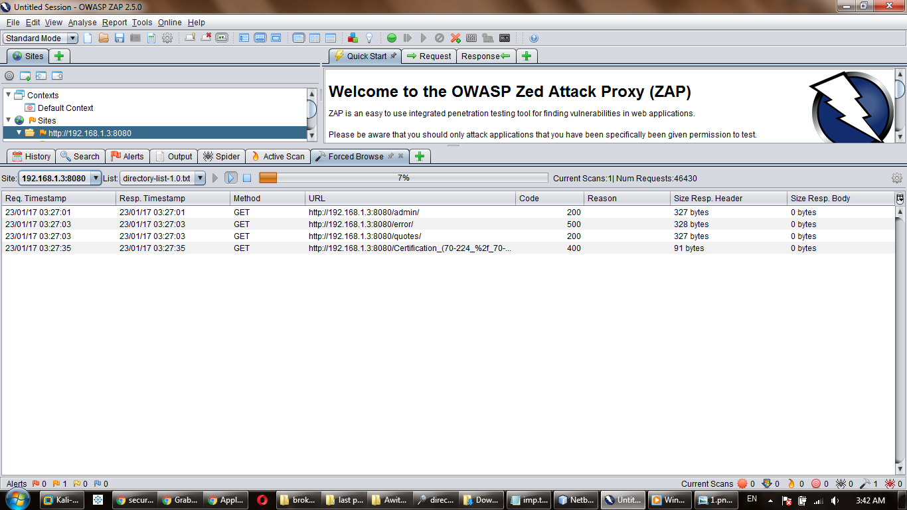

#### Identifying the vulnerability using _DIRB:_

> DIRB is a Web Content Scanner. It looks for existing (and/or hidden) Web Objects. It basically works by launching a dictionary based attack against a web server and analizing the response.

1. We'll start by scanning our web-app content:

  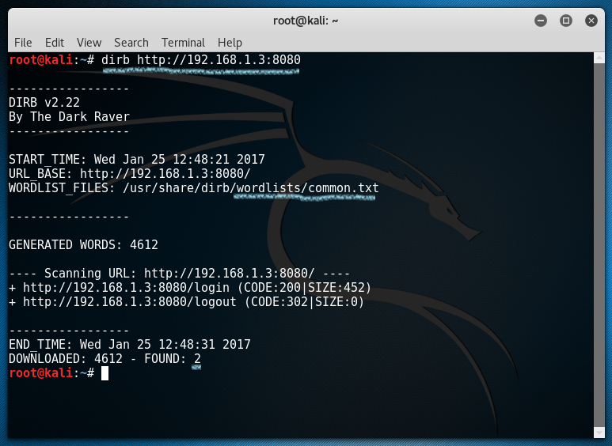
  
  DIRB found only 2 results.. that is because our security configuration requires any request to be authenticated:
  ```java
    http
      .authorizeRequests()
      	.anyRequest().authenticated()
  ```
  
2. We want to provide DIRB with the credentials.. in order to do so go to you browser.. and login as regural user ("user" as the username & "password" as the password).. open the `developer tools` > `Network` and copy the cookie (i.e. _JSESSIONID_):

  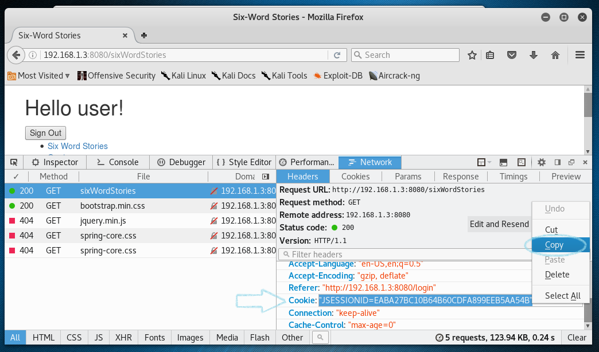

3. Now run the DIRB scan again, but this time we'll set the cookie:

  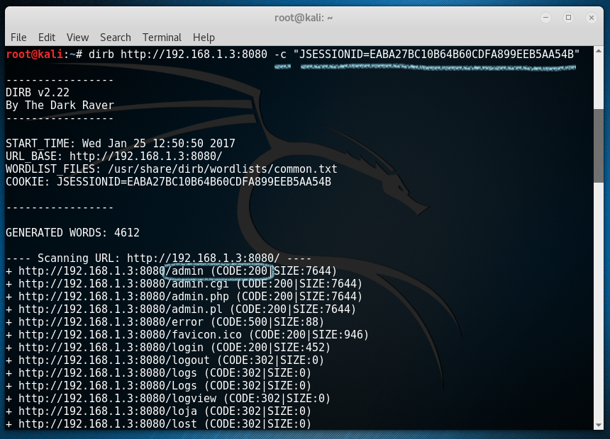  
  
  we can see clearly that DIRB has discovered the hidden web page (i.e. /admin) easily.
  
### _Where the vulnerability came from:_

Simply the application doesn't have RBAC (i.e. role-based access control) if we can say so.
That is the application has nothing that prevent someone to access some resource based on his role(e.g. user, admin.. etc).
Let's take a look at our custom security configuration:

```java
  @EnableWebSecurity
  public class SecurityConfig extends WebSecurityConfigurerAdapter {
    @Override
    protected void configure(HttpSecurity http) throws Exception {
      http
        .authorizeRequests()
          .anyRequest().authenticated()
          .and()
        .formLogin()
        .and()
        .csrf().disable();            
    }

    @Autowired
    public void configureGlobal(AuthenticationManagerBuilder auth) throws Exception {          
      auth
        .inMemoryAuthentication()
        .withUser("user").password("password").roles("USER")
        .and()
        .withUser("admin").password("test").roles("ADMIN");        
    }    
  }
```

So even if our app offers some sort of authentication, but he doesn't offer authorization at all.

### _How to fix it:_

Modify the _configure()_ method in our custom security configuration class (i.e. _SecurityConfig_) to be like that:

```java
@Override
  protected void configure(HttpSecurity http) throws Exception {
    http
      .authorizeRequests()
        .antMatchers("/admin/**").hasRole("ADMIN")
        .anyRequest().authenticated()
        .and()
      .formLogin()
      .and()
      .csrf().disable();             
  }
```

The regex (i.e. regural expression) in the _antMatchers()_ matchs any URL that starts with "/admin/". These -who matches- will be restricted to users who have the role "ADMIN".

## **A1-Injection**

> Injection flaws, such as SQL, OS, and LDAP injection occur when untrusted data is sent to an interpreter as part of a command or query. The attacker’s hostile data can trick the interpreter into executing unintended commands or accessing data without proper authorization.

### _Required steps to reproduce the vulnerability:_

1. Navigate to Quotes page (e.g. http://localhost:8080/quotes). And if you prompted for credentials type "user" as the username & "password" as the password.
2. In the input field next to "ID:", type a numeric value (e.g. 15).
3. In the input field next to "Quote:", write:
  `take care'); DROP TABLE Quotes;--` and click on "Post".
4. Now you are redirected to a page that tells you: `Table "QUOTES" not found;`, that's because  `DROP TABLE` statement removed the table.

#### Identifying the vulnerability using _OWASP Zed Attack Proxy (ZAP):_

(Notice that you can identify this vulnerability with _Burp Suite_ & _sqlmap_ as well).

1. Click on `New Fuzzer` and choose `http://localhost:8080`, then choose `POST:quotes(content,id)` and click `select`. Then highlight the value of the id parameter and choose `Regex (*Experimental*)` from the drop-down list, then type `'\d'` in the `Regex` input field and type `10000` in the `Max Payloads` field and click `add` > `OK`.

  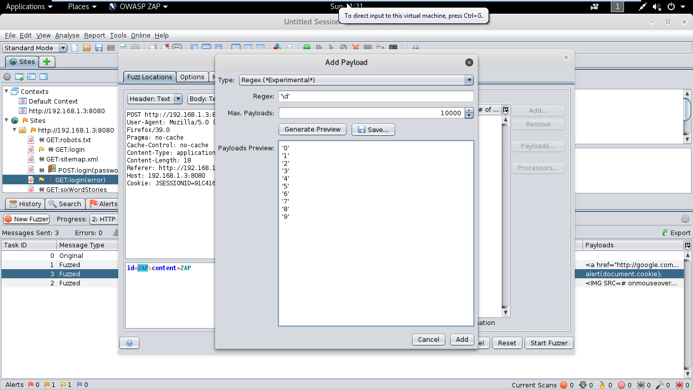
2. Do the same for the value of the content parameter but this time with a `File Fuzzers` (SQL Injection that contains [Active SQL Injection & MySQL Injection 101]). Finally click on `Start Fuzzer`.

  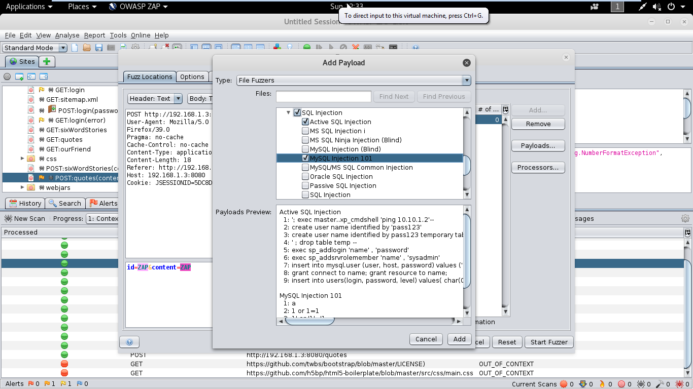
  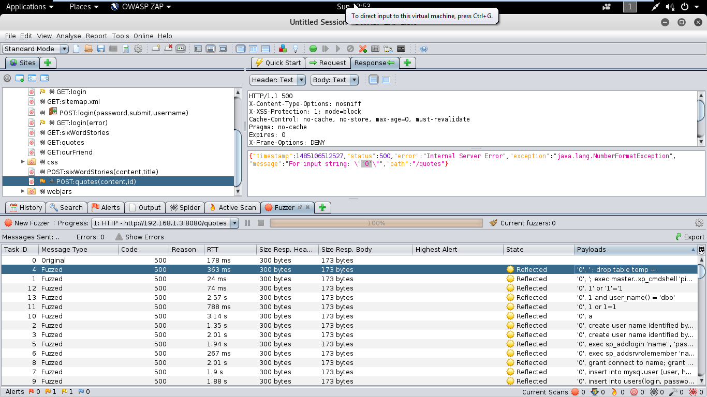

### _Where the vulnerability came from:_

In the _QuoteService_ class specifically in the _addQuote()_ method, we used the so called "Dynamic Queries" to concatenate data that is supplied by the user -who maybe is a potential attacker- to the query itself. Take a look at the vulnerable code:

```java
 String query = "INSERT INTO Quotes (id, content) VALUES ('" + quote.getId().toString() + "', '" + quote.getContent() + "')";
 Statement statement = connection.createStatement();
 statement.execute(query);
 statement.close();
```

After the Malicious Input is supplied (e.g. `15` & `take care'); DROP TABLE Quotes;--`), the query looks like this:

```sql
 INSERT INTO Quotes (id, content) VALUES ('15', 'take care'); DROP TABLE Quotes;--')
```

### _How to fix it:_

SQL injection attacks can be prevented very easy. In our example we'll use "Parameterized Queries". As I wrote my app with Java, I'll use "Prepared Statements". The SQL statement is precompiled and stored in a PreparedStatement object. In order to fix the vulnerability we have to substitute the vulnerable code with this safe code:

```java
 String query = "INSERT INTO Quotes (id, content) VALUES (?, ?)";
 PreparedStatement pstmt = connection.prepareStatement(query);
 pstmt.setInt(1, quote.getId());
 pstmt.setString(2, quote.getContent());
 pstmt.execute();
 pstmt.close();
```

## **A6-Sensitive Data Exposure**

> Many web applications do not properly protect sensitive data, such as credit cards, tax IDs, and authentication credentials. Attackers may steal or modify such weakly protected data to conduct credit card fraud, identity theft, or other crimes. Sensitive data deserves extra protection such as encryption at rest or in transit, as well as special precautions when exchanged with the browser.

### _Required steps to reproduce the vulnerability:_ 

1. If you are already logged in, log out by clicking _Sign Out_. You will be redirected to the login page.
2. Enter the credentials (i.e. type "user" as the username & "password" as the password).
3. Now If you are connected to a Wireless Network & this web application are hosted on a real server or another host (i.e. you are connected to web-app via wireless network) then you just did send your sensitive data (credentials) in plain text format and somebody can view these by capturing or sniffing the network traffic from the air.

#### Identifying the vulnerability using _Fiddler:_

In this section, I will demonstrate some sort of a Man in the middle (MITM) attack.
We will use _Fiddler_ to capture HTTP traffic.

1. If you are already logged in, log out by clicking _Sign Out_. You will be redirected to the login page.

2. Open _Fiddler_.

3. Now go back to you browser and enter the credentials (i.e. type "user" as the username & "password" as the password).

4. Go back to _Fiddler_ and look up for the _http post_ request you just made, click on it.. then click on `Inspector` then click on either `TextView` or `WebForms`. You will see that the credentials sent in plain-text:

  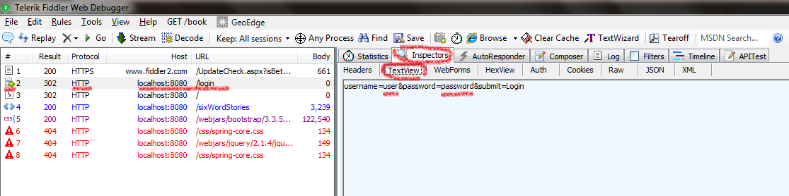
  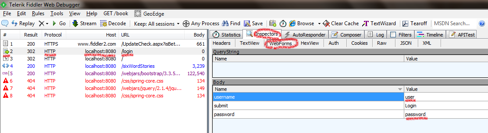

#### Identifying the vulnerability using _Wireshark:_

In this section, I will demonstrate some sort of a Man in the middle (MITM) attack.
We will use _Wireshark_ to capture HTTP traffic. 

Now the problem with _Wireshark_ is that you can't capture the loopback interface on Windows:

  > If you are trying to capture traffic from a machine to itself, that traffic will not be sent over a real network interface, even if it's being sent to an address on one of the machine's network adapters. This means that you will not see it if you are trying to capture on, for example, the interface device for the adapter to which the destination address is assigned. You will only see it if you capture on the "loopback interface", if there is such an interface and it is possible to capture on it.

So if your OS (i.e. Operating System) is Windows do these steps (Otherwise skip to step 2):

1. Now normally if you install _Wireshark_, you will prompted to install _WinPcap_ too. Here, after you done the _Wireshark_ installation, install _Npcap_ (which is an update _of WinPcap_) and make sure that you've selected "` Support loopback traffic ("Npcap Loopback Adapter" will be created) `" option. The benefit of _Npcap_ here that it will create an `Npcap Loopback Adapter` that can be selected in Wireshark in order to capture IPv4/IPv6 loopback traffic. 
  
  > WinPcap is the Windows version of the libpcap library; it includes a driver to support capturing packets. Wireshark uses this library to capture live network data on Windows.

2. If you are already logged in, log out by clicking _Sign Out_. You will be redirected to the login page.

3. Open _Wireshark_. If you are in Windows, double click on `Npcap Loopback Adapter` (Otherwise double click on `Loopback: lo`).

4. Now go back to you browser and enter the credentials (i.e. type "user" as the username & "password" as the password).

5. Go back to _Wireshark_ and look up for the _post http_ request you just made, click on it. You will see that the credentials sent in plain-text:

  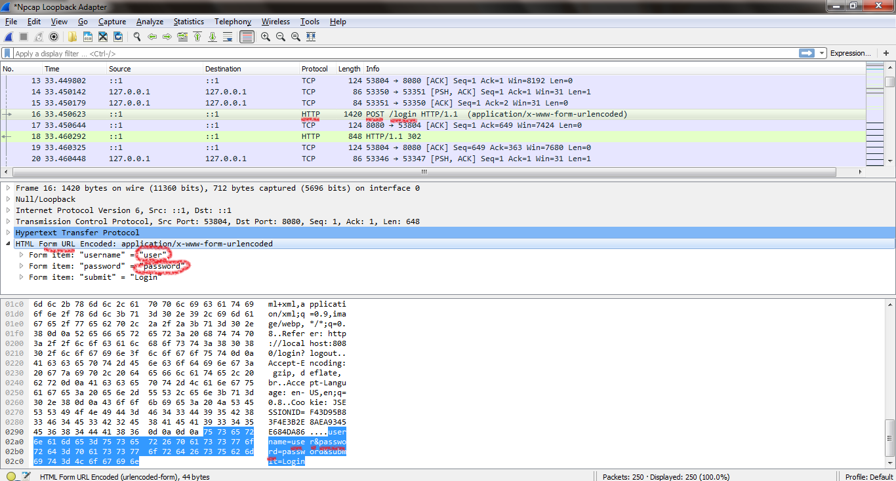

#### Identifying the vulnerability using _Ettercap:_

In this section, I will demonstrate some sort of a Man in the middle (MITM) attack.
We will use _Ettercap_ to capture HTTP traffic.

1. If you are already logged in, log out by clicking _Sign Out_. You will be redirected to the login page.

2. Open _Ettercap_. Click on `Sniff` > `Unified Sniffing`:

  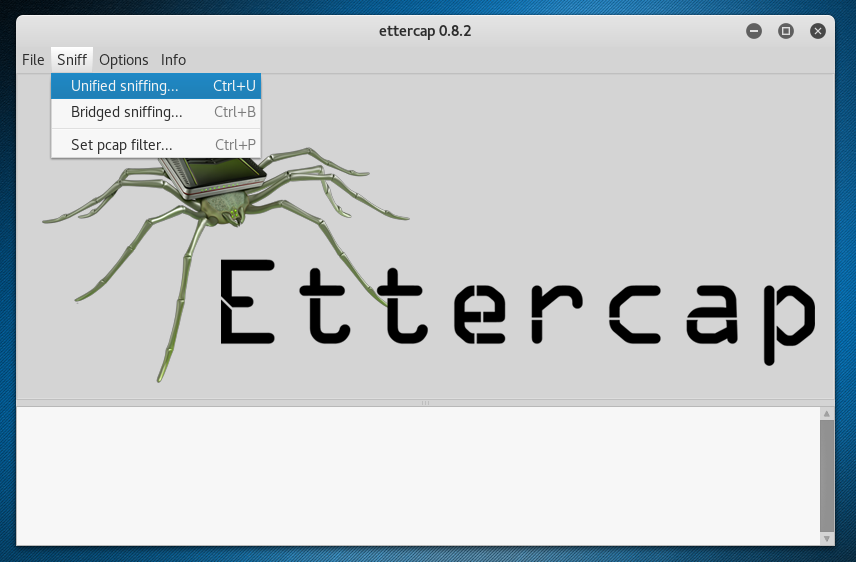
  
3. If you are running the wep-application on the same machine choose `Local Loopback`. If it's running on another machine or you are using the _Ettercap_ from a virtual machine (e.g. Kali Linux) choose `eth0`:

  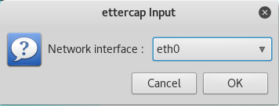
  
4. Go back to you browser and enter the credentials (i.e. type "user" as the username & "password" as the password).

5. Now go back to _Ettercap_ and look up for the _http_ request you just made, You will see that the credentials sent in plain-text:

  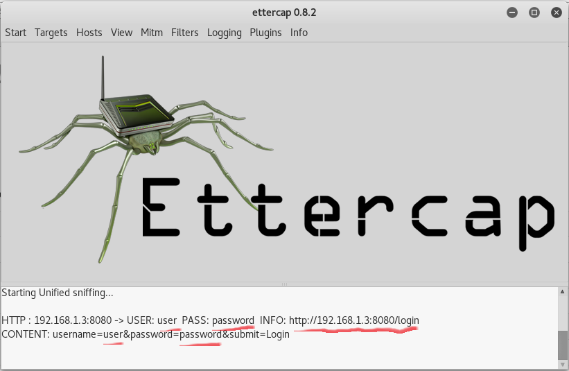

### _Where the vulnerability came from:_

Even if we encrypt the credentials in our database (using Bcrypt for example),  the data is transmitted in clear text from client(browser) to server(webserver).
We saw earlier that in that case if somebody is able to capture network traffic then he can look up for that information easily. 

  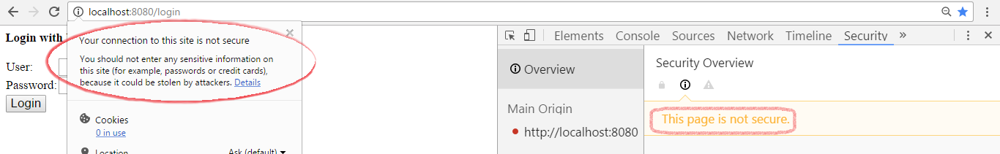

### _How to fix it:_

1. Genarate a `Self Signed Certificate`: As we are just testing our application, we don't bother purchasing a trusted certificate. So we will generate our own certificate. 

  We already have the JDK installed, so the Java `keytool` comes in handy:

  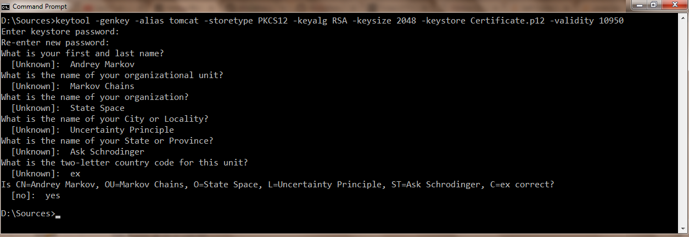

  Next we'll copy the certificate: 

  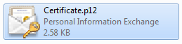

  to the classpath (i.e. our project folder "../broken-web-application/").

2. Normaly when you run the application, `Tomcat` listens for `HTTP` on port 8080:

  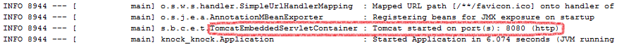

  in order to configure our Tomcat to listen for `HTTPS` on port 8443, add these lines to `application.properties` file:

  ```
    server.port: 8443
    server.ssl.key-store: Certificate.p12
    server.ssl.key-store-password: UuHh$3
    server.ssl.keyStoreType: PKCS12
    server.ssl.keyAlias: tomcat
  ```
 
3. Run the application.. 

  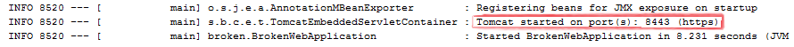

  Now go to your browser & navigate to "http**s**://localhost:**8443**".. this page will appear:

  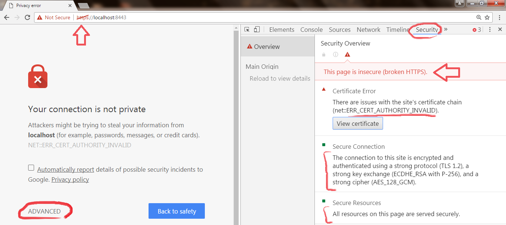

  what happened here is that the browser compared our generated certificate against some sort of white-list certificates and didn't find it there and that's OK. Actually _firefox_ show us more explanatory message:

  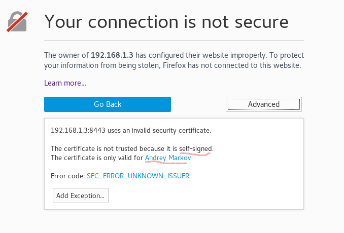

  So we need to get rid of this message because we trust the certificate we just generated.. on _Chrome_ click on `Advanced` > `Proceed to localhost (unsafe)` and on _firefox_ click on `Add Exception` > `Confirm Security Exception`.

  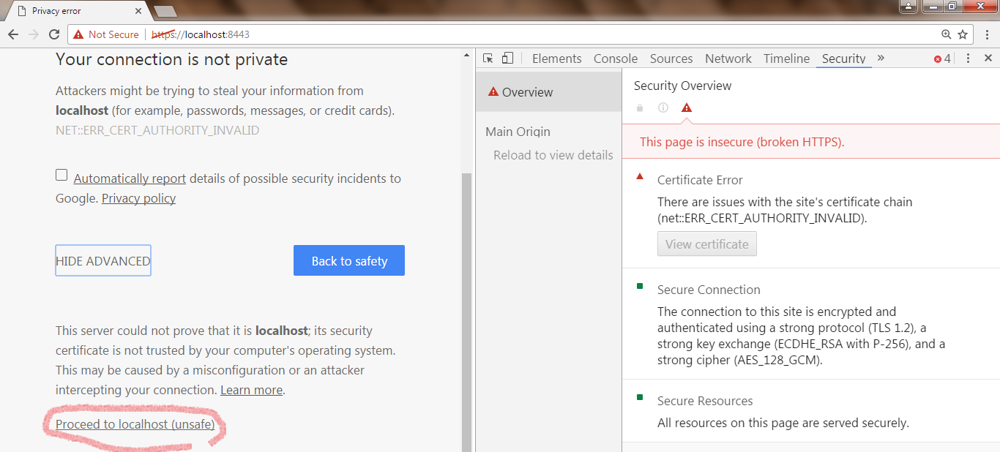
  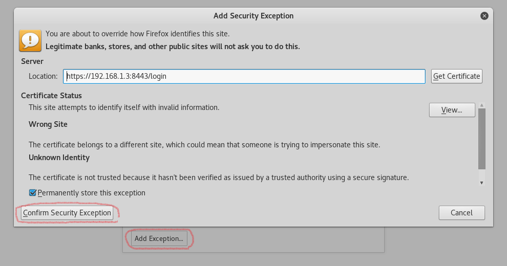
  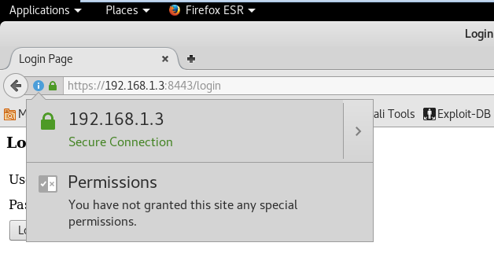

4. There is another problem.. try to navigate to "http://localhost:8443" and this message will appear:

  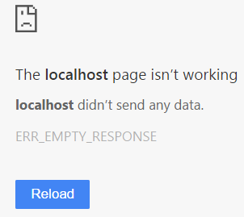

  the problem that we have one _Tomcat Connector_ that listens for HTTPS request.. we need to add another one to redirect the HTTP requests to HTTPS. Unfortunately _Spring Boot_ doesn't support multiple connectors to be configured in `application.properties` file.. so we need to configure the HTTP connector programmatically.
 
  Create new _class_ `TwoConnectors` under `broken.config` package:
  (Note: these code is written by [_Driss Amri_](https://drissamri.be/blog/java/enable-https-in-spring-boot/))
   
  ```java
  /**
  * Support HTTP programmatically after 
  * configuring HTTPS connector via application.properties
  */
  package broken.config;

  import org.apache.catalina.Context;
  import org.apache.catalina.connector.Connector;
  import org.apache.tomcat.util.descriptor.web.SecurityCollection;
  import org.apache.tomcat.util.descriptor.web.SecurityConstraint;
  import org.springframework.boot.context.embedded.EmbeddedServletContainerFactory;
  import org.springframework.boot.context.embedded.tomcat.TomcatEmbeddedServletContainerFactory;
  import org.springframework.context.annotation.Bean;
  import org.springframework.context.annotation.Configuration;

  @Configuration
  public class TwoConnectors {

    @Bean
    public EmbeddedServletContainerFactory servletContainer() {
      TomcatEmbeddedServletContainerFactory tomcat = new TomcatEmbeddedServletContainerFactory() {
        @Override
        protected void postProcessContext(Context context) {
        SecurityConstraint securityConstraint = new SecurityConstraint();
        securityConstraint.setUserConstraint("CONFIDENTIAL");
        SecurityCollection collection = new SecurityCollection();
        collection.addPattern("/*");
        securityConstraint.addCollection(collection);
        context.addConstraint(securityConstraint);
      }
    };

      tomcat.addAdditionalTomcatConnectors(initiateHttpConnector());
      return tomcat;
    }

    private Connector initiateHttpConnector() {
      Connector connector = new Connector("org.apache.coyote.http11.Http11NioProtocol");
      connector.setScheme("http");
      connector.setPort(8080);
      connector.setSecure(false);
      connector.setRedirectPort(8443);

      return connector;
    }

  }
  ```

5. "Clean & Build" the project then run it.. you will see that _Tomcat_ handles both HTTPS & HTTP:

  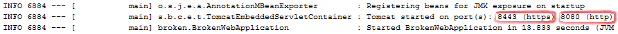
  
  You can verify that both are working by navigating to "http://localhost:8080" & "https://localhost:8443" via your browser.
