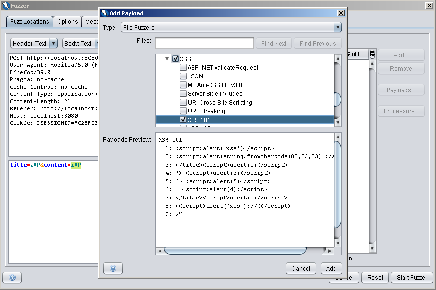

# **broken-web-application**
Spring Web-App that contains five different flaws -from the OWASP 2013 Top 10 List- and their fixes.

## _Vulnerability:_ **A3-Cross-Site Scripting (XSS)**

> XSS flaws occur whenever an application takes untrusted data and sends it to a web browser without proper validation or escaping. XSS allows attackers to execute scripts in the victim’s browser which can hijack user sessions, deface web sites, or redirect the user to malicious sites.

### _required steps to reproduce the vulnerability:_ 

1. Navigate to Six-Word Sories page (e.g. http://localhost:8080/sixWordStories). And if you prompted for credentials type "user" as the username & "password" as the password.
2. Insert any text in the input field next to "Title:" (e.g. xss).
3. In the input field next to "Story:", write: 
  `</noscript> <code onmouseover=a=eval;b=alert;a(b(/XSS/.source));>MOVE MOUSE OVER THIS AREA</code>` and click on "Add". 
4. You can see that new Story has been added and if you hover your mouse on it you got a Popup message-box that says "XSS".

#### Identifying the vulnerability using _OWASP Zed Attack Proxy (ZAP):_

1. Open the OWASP Zed Attack Proxy (ZAP), on the `quick start` tab type "http://localhost:8080" inside the `URL to attack` & click on `Attack`. You will notice that all requests refused by the server because you have to login first. So we will _fuzz_ the username & password.
2. Click on `New Fuzzer` and choose `http://localhost:8080`, then choose `POST:login(password,submit,username)` and click `select`. Then highlight the value of the username parameter and add a file that contains most common usernames as a payload. Do the same for the value of the password parameter but this time with a file contains the most common passwords. Finally click on `Start Fuzzer`.

3. After the fuzzing is completed, we need to search for something odd in the results. We notice that the size of the response header is the same for all requests except for two requests: the first request contains(user, password) as a payload, and the second contains(admin, test) as a payload. those are the right credentials we need.

4. Create new context to add the credentials: click on `sites` then right click on `http://localhost:8080` > `Include in Context` > `New Context`.

5. Choose `Authentication` and select `Form-based Authentication` from the drop-down list, Choose `http://localhost:8080/login` as the Login Form Target URL, then choose `username` as the username parameter & `password` as the password parameter.

6. Choose `Users`, then click on `Add`, give an arbitrary name for `User Name` such as "Normal User", and type "user" as the `Username` & "password" as the `Password`, then click `OK`.

7. Choose `Spider` and click on `New Scan` and choose `http://localhost:8080` as starting point, choose both the Context & the user you just created then click on `Start Scan`.

8. You will notice that -unlike the first time which returned a login error page for every request- now the `Spider` can create a map of the application with all the points of access to the application (no not really! check the _Missing Function Level Access Control_ vulnerability section).

9. Now click on `New Fuzzer` and choose `http://localhost:8080`, then choose `POST:sixWordStories(content,title)` and click `select`. Then highlight the value of the content parameter and add a `file fuzzer` (XSS that contains [XSS101, XSS102 and XSS HTML Breaking]) as a payload. Finally click on `Start Fuzzer`.

10. After completion of the fuzzing process, navigate to `http://localhost:8080/sixWordStories` and you will notice pop-up messages and other thing that indicates XSS vulnerability.

### _where the vulnerability came from:_

First of all, We use "Thymeleaf" as our template engine. So in "sixWordStories.html", there is unescaped element in the template:

`<td th:utext="${post.content}"></td>`

here the "th:utext" (for "unescaped text") caused the XSS vulnerability, because it tells the "Thymeleaf" not to escape the text which may contain malicious javascript code.

### _how to fix it:_

Simply you can use `th:text` instead of `th:utext`. `th:text` is the default behaviour of "Thymeleaf" which makes sure that text should be escaped.

## _Vulnerability:_ **A1-Injection**

> Injection flaws, such as SQL, OS, and LDAP injection occur when untrusted data is sent to an interpreter as part of a command or query. The attacker’s hostile data can trick the interpreter into executing unintended commands or accessing data without proper authorization.

### _required steps to reproduce the vulnerability:_

1. Navigate to Quotes page (e.g. http://localhost:8080/quotes). And if you prompted for credentials type "user" as the username & "password" as the password.
2. In the input field next to "ID:", type a numeric value (e.g. 15).
3. In the input field next to "Quote:", write:
  `take care'); DROP TABLE Quotes;--` and click on "Post".
4. Now you are redirected to a page that tells you: `Table "QUOTES" not found;`, that's because  `DROP TABLE` statement removed the table.

#### Identifying the vulnerability using _OWASP Zed Attack Proxy (ZAP):_

1. Click on `New Fuzzer` and choose `http://localhost:8080`, then choose `POST:quotes(content,id)` and click `select`. Then highlight the value of the id parameter and choose `Regex (*Experimental*)` from the drop-down list, then type `'\d'` in the `Regex` input field and type `10000` in the `Max Payloads` field and click `add` > `OK`.

2. Do the same for the value of the content parameter but this time with a `File Fuzzers` (SQL Injection that contains [Active SQL Injection & MySQL Injection 101]). Finally click on `Start Fuzzer`.

### _where the vulnerability came from:_

In the _QuoteService_ class specifically in the _addQuote()_ method, we used the so called "Dynamic Queries" to concatenate data that is supplied by the user -who maybe is a potential attacker- to the query itself. Take a look at the vulnerable code:

` String query = "INSERT INTO Quotes (id, content) VALUES ('" + quote.getId().toString() + "', '" + quote.getContent() + "')";`

` Statement statement = connection.createStatement();`

` statement.execute(query);`

` statement.close();`

After the Malicious Input is supplied (e.g. `15` & `take care'); DROP TABLE Quotes;--`), the query looks like this:

` "INSERT INTO Quotes (id, content) VALUES ('15', 'take care'); DROP TABLE Quotes;--')"`

### _how to fix it:_

SQL injection attacks can be prevented very easy. In our example we'll use "Parameterized Queries". As I wrote my app with Java, I'll use "Prepared Statements". The SQL statement is precompiled and stored in a PreparedStatement object. In order to fix the vulnerability we have to substitute the vulnerable code with this safe code:

` String query = "INSERT INTO Quotes (id, content) VALUES (?, ?)";`

` PreparedStatement pstmt = connection.prepareStatement(query);`

` pstmt.setInt(1, quote.getId());`

` pstmt.setString(2, quote.getContent());`

` pstmt.execute();`

` pstmt.close();`

## _Vulnerability:_ **A10-Unvalidated Redirects and Forwards**

> Web applications frequently redirect and forward users to other pages and websites, and use untrusted data to determine the destination pages. Without proper validation, attackers can redirect victims to phishing or malware sites, or use forwards to access unauthorized pages.

### _required steps to reproduce the vulnerability:_

1. Navigate to either Six-Word Sories page (i.e. http://localhost:8080/sixWordStories) or Quotes page (i.e. http://localhost:8080/quotes). And if you prompted for credentials type "user" as the username & "password" as the password.
2. At the top of the page, click on "Our Friend" link. It will open a new tab on your browser and display a page that tells you "If this vulnerability worked, your previous page is now redirected to www.hackerrank.com".
3. Check your previous page now to make sure that the redirection happened.

### _where the vulnerability came from:_

In "header.html" template, the "Our Friend" link is constructed using this piece of code:

` <li><a th:href="@{/ourFriend}" target="_blank">Our Friend</a></li>`

Notice `target="_blank"` which opens the linked document (i.e. /ourFriend) in a new window or tab.
The Problem is that the destination page (i.e.. /ourFriend) has the ability to control the location of this page by modifying `window.opener.location`. It may leads to phishing attacks. 

In our site we refer to /ourFriend page as friend web page that is trusted by us. but what if this page has been hacked recently and someone insert a malicious code in it, for example:

` `

In this example the destination page attempts to modify the location of this page using `window.opener.location.replace('https://www.hackerrank.com');`

### _how to fix it:_

One of the solutions for this problem is to add an attribute `rel="noreferrer noopenner"` to the hyperlink element. In our example we need to modify it to be like this:

` <li><a th:href="@{/ourFriend}" target="_blank" rel="noreferrer noopenner">Our Friend</a></li>`

## _Vulnerability:_ **A8-Cross-Site Request Forgery (CSRF)**

> A CSRF attack forces a logged-on victim’s browser to send a forged HTTP request, including the victim’s session cookie and any other automatically included authentication information, to a vulnerable web application. This allows the attacker to force the victim’s browser to generate requests the vulnerable application thinks are legitimate requests from the victim.

### _required steps to reproduce the vulnerability:_

1. Navigate to "Quotes" page (i.e. http://localhost:8080/quotes). And if you prompted for credentials type "user" as the username & "password" as the password.
2. In the Project folder (i.e. ../broken-web-application) there is a template called "csrf.html", open it on your browser (right click on "csrf.html" and choose "Open").

  [IMPORTANT: open the "csrf.html" with the same browser you have logged in with]
3. The page contains a text "Want to win a lot of money with just ONE click!" and a button "Win Money!".. who doesn't want to win money! click on it.
4. Navigate to "Quotes" page (i.e. http://localhost:8080/quotes), you will find that there is a new quote added with ID #99 and	Quote "Inappropriate text contains Profanity". So simply the csrf.html manipulated you by inserting a quote against your will.

### _where the vulnerability came from:_

The malicious page (i.e. csrf.html) has a hidden form inside of it that will be submitted if you hit the "Win Money!" button. Take a look at the code:

` <form id="command" action="http://localhost:8080/quotes" method="post">`

`   <input type="hidden" name="id" value="99">`

`   <input type="hidden" name="content" value="Inappropriate text contains Profanity">`

`   <input value="Win Money!" type="submit">`

`</form>`

Because you are currently authenticated by a cookie saved in your browser, the malicious page may send an HTTP request on your behalf to the site -which trusts you- and thereby causes an unwanted action Without your intention. Here the side effects may be posting text contains profanity which leads to ban you from the site. 

It is also worth to mention that the malicious page could be implemented to be more tricky that you doesn't need to click on anything and the request will be sent as soon as you just open the page.

### _how to fix it:_

The problem with this vulnerability is that there is no difference between the HTTP request sent by the malicious page and the one that sent by you. So we need to add something to the HTTP request can't be supplied by the malicious site. So in order to complete the request the sender needs to provide the cookie and a token. Every time a request is sent, the server must compare the expected value of the Token with Token itself and if there is no match, the request will not be completed.

So how we prevent CSRF in Spring?.. First we need to include the security dependencies in _pom.xml_: 

`<dependency>`

`                <groupId>org.springframework.security</groupId>`

`                <artifactId>spring-security-web</artifactId>`

`            </dependency>`

`            <dependency>`

`                <groupId>org.springframework.security</groupId>`

`                <artifactId>spring-security-config</artifactId>`

`            </dependency>`

and Second we annotate our application with _@EnableWebSecurity_ annotation like that:

`@EnableWebSecurity`

`@SpringBootApplication`

`public class BrokenWebApplication {`

`	public static void main(String[] args) {`

`		SpringApplication.run(BrokenWebApplication.class, args);`

`	}`

`}`

or if we already made a custom security configuration we can just annotate our custom security configuration class without annotation the application class like that:

`@EnableWebSecurity`

`public class SecurityConfig extends WebSecurityConfigurerAdapter {`
	
`    // Your Custom Security Configuration`
    
`}`

So by including these dependencies, Spring by default prevent CSRF by adding a CSRF Token. So if you tried again to exploit this vulnurability it would fail and will got something like: 
`Invalid CSRF Token 'null' was found on the request parameter '_csrf' or header 'X-CSRF-TOKEN'.`

Notice that if the application contains the security dependencies & the `@EnableWebSecurity` annotation and still has CSRF vulnerability, so probably your custom security configuration conatins this piece of code `http.csrf().disable()` which disable CSRF protection. So to activate the CSRF protection again you shoud delete this piece of code to return the default Spring security configuration.  

## _Vulnerability:_ **A7-Missing Function Level Access Control**

> Most web applications verify function level access rights before making that functionality visible in the UI. However, applications need to perform the same access control checks on the server when each function is accessed. If requests are not verified, attackers will be able to forge requests in order to access functionality without proper authorization.

### _required steps to reproduce the vulnerability:_

_Inception:_ Even if the UI(i.e. User Interface) doesn't show navigation to the unauthorized "admin" page, the attacker can simply force the browser to target the "admin" page URL.
In our case, if the attacker knows the URL of the "admin" page, he can just type http://localhost:8080/admin in the address bar of the browser and he is successfully navigated to the unauthorized page. The "admin" page allows whoever can access it to delete any story or quote.

1. Navigate to (http://localhost:8080/). And if you prompted for credentials type "user" as the username & "password" as the password.
2. In in the address bar of your browser , force it to navigate to the admin page (i.e. http://localhost:8080/admin).
3. Although you are logged in as a normal user, the "admin panel" page is shown and you can now delete any story or quote like if you are the administrator (some sort of privilege escalation).

### _where the vulnerability came from:_

Simply the application doesn't have RBAC (i.e. role-based access control) if we can say so.
That is the application has nothing that prevent someone to access some resource based on his role(e.g. user, admin.. etc).
Let's take a look at our custom security configuration:

`@EnableWebSecurity`

`public class SecurityConfig extends WebSecurityConfigurerAdapter {`
    
`    @Override`

`    protected void configure(HttpSecurity http) throws Exception {`

`        http`

`                .authorizeRequests()`

`                    .anyRequest().authenticated()`

`                    .and()`

`               .formLogin()`

`               .and()`

`               .csrf().disable();`
                
`   }`
    
`   @Autowired`

`   public void configureGlobal(AuthenticationManagerBuilder auth) throws Exception {`
        
`       // In-memory Authentication: not Ideal for real world (In production use Bcrypt for example)       `        
        
`       auth`

`               .inMemoryAuthentication()`

`               .withUser("user").password("password").roles("USER")`

`               .and()`

`               .withUser("admin").password("test").roles("ADMIN");`
        
`    }`
    
`}`

So even if our app offers some sort of authentication, but he doesn't offer authorization at all.

### _how to fix it:_

Modify the _configure()_ method in our custom security configuration class (i.e. _SecurityConfig_) to be like that:

`@Override`

`    protected void configure(HttpSecurity http) throws Exception {`

`        http`

`                .authorizeRequests()`

`                    .antMatchers("/admin/**").hasRole("ADMIN")`

`                    .anyRequest().authenticated()`

`                    .and()`

`                .formLogin()`

`                .and()`

`                .csrf().disable();`
                
`    }`

The regex (i.e. regural expression) in the _antMatchers()_ matchs any URL that starts with "/admin/". These -who matches- will be restricted to users who have the role "ADMIN".